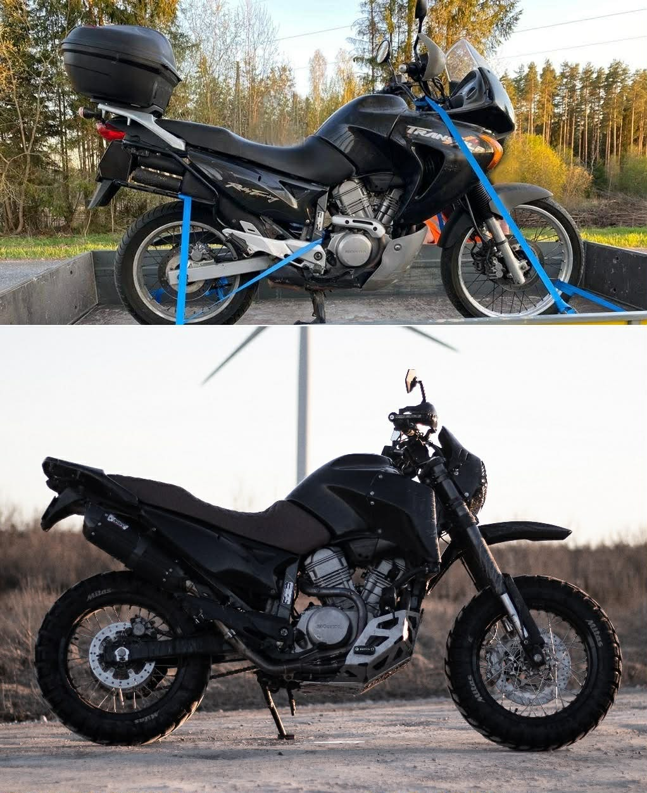

# 2003 Honda XL 650V Transalp

- **Year:** 2003 (first registered 09/2003)
- **Engine:** 647cc, 52° V-twin, SOHC, 3 valves/cyl, liquid-cooled, 52hp
- **Fuel system:** Carbureted — 2x 34mm flat-slide CV carbs (EFI only from XL700V 2008+)
- **Transmission:** 5-speed, chain drive
- **Registration:** 91BY (Estonia)
- **Purchased:** March 2026, ~€3,000–3,500
- **Odometer at purchase:** ~68,000 km
- **ARK inspection valid until:** 05/2026
- **Colour:** Black (matt black wrap over original)

## Modifications (custom build, appearance modified 2021)

| Component | Mod | Notes |
|-----------|-----|-------|
| Headers | Arrow 72068PD | — |
| Muffler | Mivv Suono Steel Black H.023.L9 | — |
| Rims | Excel 17" front + rear | Both 17" — supermoto/street scrambler config, NOT stock 21"/17" ADV setup |
| Tires | Mitas E-09 Dakar TL 120/90-17 (F), 150/70-17 (R) | — |
| Front forks | KTM units (SM690?) | Replaces soft stock 41mm Honda forks. Requires triple clamp/axle spacer work |
| Speedometer | KOSO DB-01R+ | Digital, replaces stock cluster. [Manual](docs/koso-db01r-manual.pdf) |
| Handlebar risers | RAXIMO TÜV 28.6mm +50mm | — |
| Heated grips | Daytona 4-Stage | Integrated controller |
| Headlight | Flashpoint LED 7" | — |
| Mirrors | Daytona CNC Hexagon Aluminium | — |
| Levers | AVDB short (brake + clutch) | — |
| Front brake disc | Brembo Serie Oro 68B407M4 | — |
| Rear brake disc | TRW MST347 | — |
| Front sprocket | JTF1307.15RB (15T, 520, rubber cushioned) | — |
| Rear sprocket | JTR853.48 (48T, 520) | — |
| Chain | DID 520 VX3 Gold & Black, 118 links | — |
| USB charger | Daytona slim-mount | — |
| Battery | Gel type | — |
| Seat | Custom | — |
| Bodywork | Custom stripped/restyled | Stock plastics removed |
| Side stand foot extension | — | — |
| Givi tool box | S250 + S250KIT | — |

## Accident History

**05 September 2024 — Tallinn.** Toyota Corolla (100% at fault) knocked into the bike. Repairs by M&M Motorcycles OÜ (Motorem), [invoice #2048](docs/motorem-invoice-2048.jpg) — **€2,968** covering radiator, exhaust, handlebar, fork repair/straightening, tank painting, engine case cover, engine guard, footpegs, brake/shift pedals, and disassembly/reassembly. Compensation via Swedbank P&C Insurance. Passed ARK inspection post-accident.

## Known Model Characteristics

**Strengths:** Honda V-twin reliability, comfortable touring ergonomics, good fuel range (280–350 km on 19.6L tank), huge global parts availability (shares engine with Deauville), capable on light off-road.

**Weaknesses:** Lackluster brakes, soft stock suspension (front addressed via KTM fork swap), 52hp adequate but modest on highways, valve clearance service requires bent feeler gauge (front cyl), carbs can clog if bike sits, wheel bearings and swingarm/linkage bearings wear in wet/salty climates.

## Stock Specs Reference

| Spec | Stock | This bike |
|------|-------|-----------|
| Front wheel | 21" (90/90-21) | 17" Excel |
| Rear wheel | 17" (120/90-17) tube | 17" Excel |
| Front suspension | 41mm telescopic, unadjustable, 200mm travel | KTM forks |
| Rear suspension | Pro-Link, compression adj, 172mm travel | Stock (age: 23 years) |
| Front brakes | 2x 256mm disc, 2-piston | Brembo Serie Oro disc + LA pads |
| Rear brake | 240mm disc, 1-piston | Stock |
| ABS | None (no XL650V had ABS) | — |
| Dry weight | 191 kg | — |
| Seat height | 843mm | — |

## Fuel & Range

- **Tank:** 19.6L
- **Consumption:** 4.2–5.2 L/100km
- **Range:** 280–350 km (gentle touring ~350, spirited ~280)
- Aftermarket exhaust may increase consumption slightly

## Intended Use

- Gravel and light off-road (beginner level)
- Weekend trips, 1–2 week European touring
- Possible TET sections with friend on Honda Varadero

## Seller

- Reimo Ranniku, +372 5806 2883, via mototehnika.ee
- [YouTube video of bike](https://www.youtube.com/watch?v=XrkYIXr79WE)
